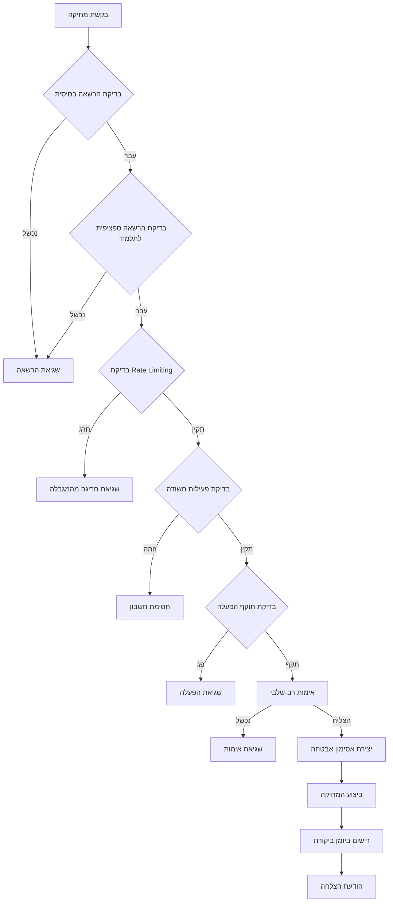

# מערכת אבטחה מקיפה למחיקה מדורגת
## Comprehensive Security System for Cascade Deletion

### סקירה כללית / Overview

מערכת אבטחה רב-שכבתית המיועדת להגן על פעולות מחיקה מדורגת במערכת הקונסרבטוריון. המערכת כוללת בקרת גישה מבוססת תפקידים, אימות רב-שלבי, ניטור פעילות חשודה, והגבלת קצב פעולות.

A multi-layered security system designed to protect cascade deletion operations in the conservatory application. The system includes role-based access control, multi-step verification, suspicious activity monitoring, and rate limiting.

---

## 🏗️ ארכיטקטורת המערכת / System Architecture

### רכיבי הליבה / Core Components

```
┌─────────────────────────────────────────────────────────────┐
│                    Security Context Layer                   │
├─────────────────────────────────────────────────────────────┤
│ DeletionSecurityProvider - ניהול מצב אבטחה כללי              │
│ ├─ Rate Limiting - הגבלת קצב פעולות                        │
│ ├─ Session Management - ניהול הפעלות                       │
│ ├─ Activity Monitoring - ניטור פעילות                     │
│ └─ Token Management - ניהול אסימוני אבטחה                  │
└─────────────────────────────────────────────────────────────┘

┌─────────────────────────────────────────────────────────────┐
│                  Permission Layer                           │
├─────────────────────────────────────────────────────────────┤
│ useDeletePermissions - הוק לניהול הרשאות                     │
│ ├─ Role Validation - אימות תפקידים                         │
│ ├─ Entity Access - בקרת גישה לישויות                       │
│ ├─ Operation Scope - היקף פעולות מותרות                    │
│ └─ Risk Assessment - הערכת סיכונים                         │
└─────────────────────────────────────────────────────────────┘

┌─────────────────────────────────────────────────────────────┐
│                Verification Layer                           │
├─────────────────────────────────────────────────────────────┤
│ MultiStepVerification - אימות רב-שלבי                       │
│ ├─ Password Confirmation - אימות סיסמה                     │
│ ├─ Type Confirmation - אימות הקלדה                         │
│ ├─ Impact Acknowledgment - אישור השפעות                     │
│ └─ Biometric Verification - אימות ביומטרי (אופציונלי)      │
└─────────────────────────────────────────────────────────────┘

┌─────────────────────────────────────────────────────────────┐
│                 Security Guards Layer                       │
├─────────────────────────────────────────────────────────────┤
│ Permission Guards - שומרי הרשאות                            │
│ ├─ AdminOnlyRoute - נתיבים למנהלים בלבד                   │
│ ├─ DeletionPermissionGuard - שמירה על הרשאות מחיקה          │
│ └─ DeletionGuard - שמירה מקיפה על פעולות מחיקה             │
└─────────────────────────────────────────────────────────────┘

┌─────────────────────────────────────────────────────────────┐
│                    UI Components Layer                      │
├─────────────────────────────────────────────────────────────┤
│ Security UI Components - רכיבי ממשק אבטחה                   │
│ ├─ SecurityStatusBar - סרגל סטטוס אבטחה                    │
│ ├─ PermissionIndicator - מחוון הרשאות                       │
│ ├─ AuditLogViewer - מציג יומן ביקורת                        │
│ └─ SuspiciousActivityAlert - התראת פעילות חשודה             │
└─────────────────────────────────────────────────────────────┘

┌─────────────────────────────────────────────────────────────┐
│                  Error Handling Layer                       │
├─────────────────────────────────────────────────────────────┤
│ Security Error Handling - טיפול בשגיאות אבטחה               │
│ ├─ SecurityErrorBoundary - גבול שגיאות אבטחה                │
│ ├─ Error Classification - סיווג שגיאות                     │
│ ├─ Hebrew Error Messages - הודעות שגיאה בעברית              │
│ └─ Audit Logging - רישום שגיאות ביומן ביקורת              │
└─────────────────────────────────────────────────────────────┘
```

---

## 🔐 רכיבי האבטחה / Security Components

### 1. DeletionSecurityContext
**מיקום**: `src/contexts/DeletionSecurityContext.tsx`

הקשר ראשי לניהול מצב האבטחה במערכת המחיקה המדורגת.

**תכונות עיקריות**:
- ניהול הגבלת קצב פעולות (Rate Limiting)
- זיהוי פעילות חשודה
- ניהול אסימוני אבטחה זמניים
- ולידציית הפעלות משתמש
- רישום פעילות לביקורת

**דוגמת שימוש**:
```tsx
<DeletionSecurityProvider>
  <YourDeleteComponents />
</DeletionSecurityProvider>
```

### 2. Permission System
**מיקומים**: 
- `src/hooks/useDeletePermissions.ts`
- `src/components/security/PermissionGuards.tsx`

מערכת הרשאות מבוססת תפקידים עם תמיכה בעברית.

**תפקידים נתמכים**:
- `super_admin` / `מנהל עליון` - הרשאה מלאה
- `admin` / `מנהל` - הרשאה מוגבלת  
- `teacher` / `מורה` - הרשאה עצמית
- `staff` / `צוות` - הרשאות מותאמות

**דוגמת שימוש**:
```tsx
<DeletionPermissionGuard 
  requiredPermission="delete_cascade" 
  studentId="student_123"
>
  <DeleteButton />
</DeletionPermissionGuard>
```

### 3. Multi-Step Verification
**מיקום**: `src/components/security/MultiStepVerification.tsx`

תהליך אימות רב-שלבי למניעת מחיקות בשגגה.

**שלבי האימות**:
1. **אימות סיסמה** - ווידוא זהות המשתמש
2. **אישור הקלדה** - הקלדת שם התלמיד בעברית
3. **אישור השפעות** - הבנת ואישור השלכות המחיקה
4. **אימות ביומטרי** (אופציונלי) - לפעולות קריטיות

**דוגמת שימוש**:
```tsx
<MultiStepVerification
  open={showVerification}
  onClose={() => setShowVerification(false)}
  onVerificationComplete={handleVerificationComplete}
  studentData={{ id: "123", name: "דוד כהן" }}
  operationType="cascade"
  requiresBiometric={true}
/>
```

### 4. Security Wrappers & HOCs
**מיקום**: `src/components/security/SecurityWrappers.tsx`

רכיבי עטיפה ו-HOCs לאבטחת רכיבים קיימים.

**רכיבים עיקריים**:
- `withDeletionSecurity()` - HOC לאבטחת רכיבים
- `SecureDeleteButton` - כפתור מחיקה מאובטח
- `RateLimitedAction` - עטיפה להגבלת קצב
- `SessionValidator` - ולידציית הפעלות
- `AutoLogoutHandler` - ניתוק אוטומטי

**דוגמת שימוש**:
```tsx
const SecureComponent = withDeletionSecurity(MyComponent, {
  requiresVerification: true,
  operationType: 'cascade',
  showSecurityStatus: true
});

<SecureDeleteButton
  onClick={handleDelete}
  studentId="student_123"
  operationType="single"
  requiresVerification={true}
>
  מחק תלמיד
</SecureDeleteButton>
```

### 5. Security UI Components
**מיקום**: `src/components/security/SecurityUIComponents.tsx`

רכיבי ממשק משתמש לתצוגת מידע אבטחה.

**רכיבים זמינים**:
- `PermissionIndicator` - מחוון הרשאות משתמש
- `SecurityStatusBar` - סרגל סטטוס אבטחה כללי
- `AuditLogViewer` - מציג יומן ביקורת
- `SuspiciousActivityAlert` - התראת פעילות חשודה
- `EmergencyLockButton` - כפתור נעילת חירום

**דוגמת שימוש**:
```tsx
<SecurityStatusBar showProgress={true} showDetails={true} />
<PermissionIndicator variant="card" showDetails={true} />
<AuditLogViewer maxEntries={50} showFilters={true} autoRefresh={true} />
```

---

## 🛡️ מנגנוני אבטחה / Security Mechanisms

### 1. Rate Limiting - הגבלת קצב פעולות

**מגבלות ברירת מחדל**:
- מחיקה בודדת: 5 פעולות לדקה
- מחיקה קבוצתית: פעולה אחת ל-5 דקות  
- ניקוי מערכת: פעולה אחת לשעה
- נעילה זמנית אחרי 3 ניסיונות כושלים

**יישום**:
```typescript
const rateLimitStatus = {
  singleDeletion: { count: 0, resetTime: new Date(...) },
  bulkDeletion: { count: 0, resetTime: new Date(...) },
  cleanupOperations: { count: 0, resetTime: new Date(...) },
  isLocked: false
};
```

### 2. Suspicious Activity Detection - זיהוי פעילות חשודה

**דפוסים מנוטרים**:
- מחיקות מהירות (>10 תוך 5 דקות)
- ניסיונות אימות כושלים (>5 תוך 5 דקות)
- פעילות בשעות חריגות (22:00-06:00)
- ניסיונות הסלמת הרשאות (>3 תוך 5 דקות)
- פעולות קבוצתיות אחרי שעות

**תגובות אוטומטיות**:
- ציון סיכון 3-4: מוניטורינג מוגבר
- ציון סיכון 5-7: אזהרה למשתמש
- ציון סיכון 8+: נעילת חשבון זמנית

### 3. Session Management - ניהול הפעלות

**תכונות**:
- תוקף הפעלה: 30 דקות לפעולות רגילות
- תוקף אסימון אבטחה: 5 דקות לפעולות מחיקה
- רענון אוטומטי של הפעלות
- ולידציית שלמות הפעלה

### 4. Audit Trail - יומן ביקורת

**אירועים מתועדים**:
- כל בדיקות ההרשאות
- ניסיונות אימות (הצלחה/כישלון)
- פעולות מחיקה (ניסיון/הצלחה/כישלון)
- זיהוי פעילות חשודה
- שגיאות מערכת
- שינויים בהגדרות אבטחה

**פורמט רישום**:
```typescript
interface SecurityAuditEvent {
  eventType: 'permission_check' | 'verification_attempt' | 'deletion_attempt';
  severity: 'info' | 'warning' | 'error' | 'critical';
  userId: string;
  timestamp: Date;
  details: {
    action: string;
    resource: string;
    studentId?: string;
    operationType?: string;
    // ... פרטים נוספים
  };
}
```

---

## 🎯 זרימת אבטחה לפעולת מחיקה / Security Flow for Deletion

### שלבי האבטחה:



### קוד דוגמא למימוש הזרימה:

```typescript
async function executeSecureDeletion(studentId: string, operationType: 'single' | 'bulk' | 'cascade') {
  try {
    // 1. בדיקת הרשאה בסיסית
    const hasPermission = await validateDeletionPermission(studentId, operationType);
    if (!hasPermission.isValid) {
      throw createSecurityError('insufficient_permissions', 'authorization');
    }

    // 2. בדיקת Rate Limiting
    const rateLimitOk = checkRateLimit(operationType, userId, rateLimitStatus);
    if (!rateLimitOk.isAllowed) {
      throw createSecurityError('rate_limit_exceeded', 'rate_limit');
    }

    // 3. בדיקת פעילות חשודה
    const suspiciousActivity = await detectSuspiciousPattern(userId, recentActions);
    if (suspiciousActivity.detected && suspiciousActivity.riskScore > 7) {
      throw createSecurityError('suspicious_activity_detected', 'suspicious_activity', 'critical');
    }

    // 4. אימות רב-שלבי
    const verificationResult = await initiateMultiStepVerification(operationType);
    if (!verificationResult) {
      throw createSecurityError('verification_failed', 'validation');
    }

    // 5. יצירת אסימון אבטחה
    const securityToken = await generateSecurityToken(`delete_${operationType}`, studentId);

    // 6. ביצוע המחיקה עם האסימון
    const deletionResult = await performDeletion(studentId, operationType, securityToken);

    // 7. רישום הצלחה ביומן
    await securityAuditService.logDeletionOperation('success', {
      studentId,
      operationType,
      userId,
      securityToken: securityToken.token.substring(0, 8)
    });

    // 8. עדכון Rate Limiting
    updateRateLimit(operationType);

    return { success: true, message: 'המחיקה בוצעה בהצלחה' };

  } catch (error) {
    // טיפול בשגיאות אבטחה
    const securityError = await handleSecurityError(error, { 
      studentId, 
      operationType, 
      userId 
    });
    
    throw securityError;
  }
}
```

---

## 🔧 הגדרה והתקנה / Setup and Installation

### 1. התקנת התלויות / Dependencies Installation

```bash
# התקנת חבילות נדרשות
npm install @mui/material @mui/icons-material @emotion/react @emotion/styled
npm install react-router-dom
npm install crypto-js  # לצרכי הצפנה (אופציונלי)
```

### 2. הגדרת Provider ראשי / Main Provider Setup

```typescript
// App.tsx
import { DeletionSecurityProvider } from './contexts/DeletionSecurityContext';
import SecurityErrorBoundary from './components/security/SecurityErrorBoundary';

function App() {
  return (
    <SecurityErrorBoundary showTechnicalDetails={true}>
      <DeletionSecurityProvider>
        {/* יתר הרכיבים של האפליקציה */}
        <Router>
          <Routes>
            {/* הנתיבים שלך */}
          </Routes>
        </Router>
      </DeletionSecurityProvider>
    </SecurityErrorBoundary>
  );
}
```

### 3. הגדרת הרשאות / Permissions Configuration

```typescript
// ב-permissionsService.ts, הוסף הרשאות מחיקה:
export const DELETION_PERMISSIONS = [
  'delete_student',
  'delete_student_cascade', 
  'bulk_operations',
  'view_deletion_impact',
  'approve_cascade_deletion',
  'override_deletion_restrictions'
] as const;

// עדכן את מטריצת ההרשאות לתפקידים:
const rolePermissions = {
  super_admin: [...ALL_PERMISSIONS], // כל ההרשאות
  admin: [...STANDARD_PERMISSIONS, 'bulk_operations', 'view_deletion_impact'],
  teacher: ['delete_student'], // רק מחיקה בסיסית
  // ... יתר התפקידים
};
```

### 4. אינטגרציה עם Backend / Backend Integration

```typescript
// הוסף endpoints למחיקה מאובטחת:
const DELETION_ENDPOINTS = {
  validatePermission: '/api/deletion/validate-permission',
  performDeletion: '/api/deletion/execute',
  auditLog: '/api/audit/deletion-events',
  emergencyLock: '/api/security/emergency-lock'
};

// דוגמת קריאת API מאובטחת:
async function callSecureDeletionAPI(endpoint: string, data: any, securityToken: string) {
  const response = await fetch(endpoint, {
    method: 'POST',
    headers: {
      'Authorization': `Bearer ${authToken}`,
      'X-Security-Token': securityToken,
      'Content-Type': 'application/json'
    },
    body: JSON.stringify(data)
  });

  if (!response.ok) {
    throw handleHttpError(response);
  }

  return response.json();
}
```

---

## 📋 דוגמאות שימוש / Usage Examples

### דוגמא 1: מחיקת תלמיד בסיסית / Basic Student Deletion

```typescript
function SimpleDeleteStudent({ studentId, studentName }: { studentId: string, studentName: string }) {
  return (
    <DeletionGuard operation="single" studentId={studentId}>
      <SecureDeleteButton
        onClick={() => console.log('מוחק תלמיד:', studentName)}
        studentId={studentId}
        studentName={studentName}
        operationType="single"
        requiresVerification={true}
      >
        מחק תלמיד
      </SecureDeleteButton>
    </DeletionGuard>
  );
}
```

### דוגמא 2: מחיקה קבוצתית למנהלים / Admin Bulk Deletion

```typescript
function AdminBulkDeletion() {
  const [selectedStudents, setSelectedStudents] = useState<string[]>([]);

  return (
    <AdminOnlyRoute>
      <RateLimitedAction action="bulk">
        <DeletionGuard operation="bulk">
          <SecureDeleteButton
            onClick={() => handleBulkDeletion(selectedStudents)}
            operationType="bulk"
            requiresVerification={true}
            variant="contained"
            color="warning"
          >
            מחק {selectedStudents.length} תלמידים
          </SecureDeleteButton>
        </DeletionGuard>
      </RateLimitedAction>
    </AdminOnlyRoute>
  );
}
```

### דוגמא 3: מחיקה מדורגת קריטית / Critical Cascade Deletion

```typescript
function CascadeDeletion({ studentId }: { studentId: string }) {
  return (
    <AdminOnlyRoute requireSuperAdmin={true}>
      <Alert severity="error" sx={{ mb: 2 }}>
        <Typography>
          מחיקה מדורגת תמחק את כל הנתונים הקשורים לתלמיד ללא אפשרות שחזור!
        </Typography>
      </Alert>
      
      <DeletionGuard 
        operation="cascade" 
        studentId={studentId}
        showSecurityStatus={true}
      >
        <SecureDeleteButton
          onClick={() => handleCascadeDeletion(studentId)}
          studentId={studentId}
          operationType="cascade"
          requiresVerification={true}
          variant="contained"
          color="error"
        >
          מחיקה מדורגת
        </SecureDeleteButton>
      </DeletionGuard>
    </AdminOnlyRoute>
  );
}
```

### דוגמא 4: דשבורד ניטור אבטחה / Security Monitoring Dashboard

```typescript
function SecurityDashboard() {
  return (
    <AdminOnlyRoute>
      <Grid container spacing={3}>
        <Grid item xs={12} md={6}>
          <SecurityStatusBar showProgress={true} showDetails={true} />
        </Grid>
        
        <Grid item xs={12} md={6}>
          <Card>
            <CardHeader title="פעולות חירום" />
            <CardContent>
              <EmergencyLockButton 
                onLock={() => alert('המערכת נעולה!')}
                requiresConfirmation={true}
              />
            </CardContent>
          </Card>
        </Grid>
        
        <Grid item xs={12}>
          <AuditLogViewer 
            maxEntries={100}
            showFilters={true}
            autoRefresh={true}
            refreshInterval={30000}
          />
        </Grid>
      </Grid>
    </AdminOnlyRoute>
  );
}
```

---

## 🧪 בדיקות ואימותים / Testing and Validation

### בדיקות יחידה / Unit Tests

```typescript
// דוגמא לבדיקת validation של הרשאות
describe('Deletion Permission Validation', () => {
  it('should allow admin to delete any student', async () => {
    const result = await validateDeletionPermission('admin_123', 'student_456', 'single');
    expect(result.isValid).toBe(true);
    expect(result.scope).toBe('limited');
  });

  it('should deny teacher access to other teachers students', async () => {
    const result = await validateDeletionPermission('teacher_123', 'student_of_other_teacher', 'single');
    expect(result.isValid).toBe(false);
    expect(result.violations).toContain('אין הרשאה למחוק תלמיד זה');
  });

  it('should detect rapid deletion pattern', async () => {
    const rapidActions = Array(15).fill(null).map((_, i) => ({
      action: 'delete_student',
      timestamp: new Date(Date.now() - i * 1000), // כל שנייה
      metadata: {}
    }));

    const result = await detectSuspiciousPattern('user_123', rapidActions);
    expect(result.detected).toBe(true);
    expect(result.patternType).toBe('rapid_deletions');
    expect(result.riskScore).toBeGreaterThanOrEqual(4);
  });
});
```

### בדיקות אינטגרציה / Integration Tests

```typescript
// דוגמא לבדיקת זרימה מלאה של מחיקה מאובטחת
describe('Secure Deletion Flow', () => {
  it('should complete full secure deletion process', async () => {
    // הכנה
    const studentId = 'test_student_123';
    const userId = 'admin_user_456';
    
    // 1. בדיקת הרשאות
    const permissionCheck = await validateDeletionPermission(userId, studentId, 'single');
    expect(permissionCheck.isValid).toBe(true);

    // 2. בדיקת rate limiting
    const rateLimitCheck = checkRateLimit('single', userId, mockRateLimitStatus);
    expect(rateLimitCheck.isAllowed).toBe(true);

    // 3. יצירת אסימון אבטחה
    const securityToken = await generateSecurityToken('delete_single', 'single');
    expect(securityToken.token).toBeDefined();
    expect(securityToken.expiresAt).toBeInstanceOf(Date);

    // 4. אימות האסימון
    const tokenValidation = validateSecurityToken(securityToken.tokenId, securityToken.token);
    expect(tokenValidation.isValid).toBe(true);

    // 5. ביצוע המחיקה (mock)
    const deletionResult = await mockPerformDeletion(studentId, securityToken.token);
    expect(deletionResult.success).toBe(true);

    // 6. וידוא רישום ביומן
    const auditEntries = await mockGetAuditEntries(userId, 'deletion_attempt');
    expect(auditEntries.length).toBeGreaterThan(0);
    expect(auditEntries[0].details.action).toBe('deletion_success');
  });
});
```

---

## 📊 מטריקות ביצועים / Performance Metrics

### מדדי אבטחה עיקריים / Key Security Metrics

```typescript
interface SecurityMetrics {
  // מדדי מחיקה
  deletionOperations: {
    totalAttempts: number;        // סה"כ ניסיונות מחיקה
    successful: number;           // מחיקות מוצלחות  
    failed: number;               // מחיקות כושלות
    averageVerificationTime: number; // זמן אימות ממוצע
  };

  // מדדי הרשאות
  permissionChecks: {
    total: number;                // סה"כ בדיקות הרשאות
    granted: number;              // הרשאות שאושרו
    denied: number;               // הרשאות שנדחו
    denyReasons: Record<string, number>; // סיבות דחייה
  };

  // מדדי Rate Limiting
  rateLimiting: {
    totalHits: number;            // סה"כ חריגות מהמגבלה
    byType: Record<string, number>; // חריגות לפי סוג פעולה
    userViolations: Record<string, number>; // חריגות לפי משתמש
  };

  // אירועי אבטחה
  securityIncidents: {
    total: number;                // סה"כ אירועי אבטחה
    resolved: number;             // אירועים פתורים
    pending: number;              // אירועים ממתינים
    bySeverity: Record<string, number>; // אירועים לפי חומרה
  };
}
```

### יעדי ביצועים / Performance Targets

- **זמן תגובה לבדיקת הרשאות**: < 100ms
- **זמן השלמת אימות רב-שלבי**: < 2 דקות  
- **זמן טעינת יומן ביקורת**: < 500ms (50 רשומות)
- **זמן זיהוי פעילות חשודה**: < 200ms
- **זמינות מערכת**: 99.9%

---

## 🔒 אבטחת נתונים / Data Security

### הצפנה / Encryption

```typescript
// הצפנת נתונים רגישים בצד הלקוח
const encryptedStudentData = await encryptSensitiveData({
  id: student.id,
  name: student.name,
  personalDetails: student.personalDetails
}, 'student_data_key');

// פענוח נתונים
const decryptedData = await decryptSensitiveData(encryptedStudentData);
```

### ניקוי נתונים / Data Sanitization

```typescript
// ניקוי קלטים מהמשתמש
const sanitizedInput = sanitizeInput(userInput, 'name');
const hebrewValidation = validateHebrewInput(userInput, expectedHebrew, {
  ignoreSpaces: true,
  allowNiqqud: false
});
```

### מחיקה מאובטחת / Secure Deletion

```typescript
// מחיקה מאובטחת עם רישום מלא
await performSecureDeletion(studentId, {
  operationType: 'cascade',
  auditTrail: true,
  backupBeforeDeletion: true,
  notifyAdmins: true,
  securityToken: verifiedToken
});
```

---

## 🚨 תגובה לאירועי אבטחה / Security Incident Response

### סוגי אירועים וטיפול / Incident Types and Handling

#### 1. פעילות חשודה / Suspicious Activity
```typescript
// זיהוי ותגובה אוטומטית
if (suspiciousActivity.riskScore >= 8) {
  await lockUserAccount('Suspicious activity detected');
  await notifyAdmins({
    type: 'suspicious_activity',
    userId: user.id,
    riskScore: suspiciousActivity.riskScore,
    evidence: suspiciousActivity.evidence
  });
  await logSecurityIncident('critical', 'account_locked', suspiciousActivity);
}
```

#### 2. חריגה חוזרת מ-Rate Limiting / Repeated Rate Limit Violations
```typescript
// טיפול בחריגות חוזרות
if (userViolations[userId] >= 5) {
  await temporaryAccountSuspension(userId, '24h');
  await escalateToSecurity({
    type: 'rate_limit_abuse',
    userId,
    violationCount: userViolations[userId]
  });
}
```

#### 3. ניסיון גישה לא מורשה / Unauthorized Access Attempt
```typescript
// תגובה לניסיון גישה לא מורשה
await logSecurityViolation('unauthorized_access', {
  userId,
  attemptedResource: resourceId,
  severity: 'high',
  autoResponse: 'deny_and_alert'
});

if (attemptCount >= 3) {
  await initiateSecurityReview(userId);
}
```

---

## 📈 מעקב וניטור / Monitoring and Tracking

### דשבורד מנהל / Admin Dashboard

```typescript
function AdminSecurityDashboard() {
  const [metrics, setMetrics] = useState<SecurityMetrics>();
  const [alerts, setAlerts] = useState<SecurityAlert[]>([]);

  return (
    <AdminOnlyRoute requireSuperAdmin={true}>
      <Grid container spacing={3}>
        {/* סיכום מטריקות */}
        <Grid item xs={12} md={3}>
          <MetricCard
            title="מחיקות היום"
            value={metrics?.deletionOperations.totalAttempts || 0}
            change={+12}
            color="primary"
          />
        </Grid>

        {/* התראות אבטחה */}
        <Grid item xs={12}>
          <SecurityAlertsPanel alerts={alerts} />
        </Grid>

        {/* יומן ביקורת מפורט */}
        <Grid item xs={12}>
          <DetailedAuditLog 
            showAdvancedFilters={true}
            exportEnabled={true}
            realTimeUpdates={true}
          />
        </Grid>
      </Grid>
    </AdminOnlyRoute>
  );
}
```

### התראות בזמן אמת / Real-time Alerts

```typescript
// מערכת התראות WebSocket
const securityWebSocket = new WebSocket('wss://api.conservatory.com/security-alerts');

securityWebSocket.onmessage = (event) => {
  const alert = JSON.parse(event.data);
  
  switch (alert.type) {
    case 'suspicious_activity':
      showSuspiciousActivityAlert(alert);
      break;
    case 'bulk_deletion_request':
      notifyAdminsOfBulkDeletion(alert);
      break;
    case 'system_security_breach':
      triggerEmergencyProtocol(alert);
      break;
  }
};
```

---

## 🔄 תחזוקה ועדכונים / Maintenance and Updates

### עדכון הגדרות אבטחה / Security Settings Updates

```typescript
// עדכון מגבלות Rate Limiting
const updateRateLimits = async (newLimits: RateLimitConfig) => {
  await validateAdminPermissions();
  await auditConfigurationChange('rate_limits', newLimits);
  await applyNewRateLimits(newLimits);
  await notifySystemOfChanges();
};

// עדכון רשימת הרשאות
const updatePermissions = async (role: string, permissions: string[]) => {
  await validateSuperAdminPermissions();
  await auditPermissionChange(role, permissions);
  await updateRolePermissions(role, permissions);
  await refreshUserSessions();
};
```

### ניקוי נתונים תקופתי / Periodic Data Cleanup

```typescript
// ניקוי יומני ביקורת ישנים (90+ ימים)
const cleanupOldAuditLogs = async () => {
  const cutoffDate = new Date(Date.now() - 90 * 24 * 60 * 60 * 1000);
  
  await archiveOldAuditEntries(cutoffDate);
  await deleteArchivedEntries(cutoffDate);
  await optimizeAuditDatabase();
};

// ניקוי אסימונים פגי תוקף
const cleanupExpiredTokens = async () => {
  const expiredTokens = await getExpiredSecurityTokens();
  await revokeTokens(expiredTokens);
  await clearTokenCache();
};
```

---

## 📚 משאבים נוספים / Additional Resources

### קישורים חשובים / Important Links

- [תיעוד API האבטחה](./security-api-docs.md)
- [מדריך פתרון בעיות](./security-troubleshooting.md)
- [בדיקות אבטחה](./security-tests.md)
- [דוגמאות קוד](./security-examples/)

### כלים לפיתוח / Development Tools

```bash
# כלי בדיקת אבטחה
npm run security:audit
npm run security:test  
npm run security:lint

# כלי ניטור ביצועים
npm run performance:monitor
npm run audit:generate-report
```

### תמיכה וקהילה / Support and Community

- **דוא"ל תמיכה**: security-support@conservatory.example
- **תיעוד טכני**: [Wiki מפורט](https://github.com/conservatory/security-wiki)
- **דוחות באגים**: [GitHub Issues](https://github.com/conservatory/security/issues)

---

## ⚠️ הערות אבטחה חשובות / Important Security Notes

### אזהרות / Warnings

1. **אל תשמור מפתחות הצפנה בקוד** - השתמש במשתני סביבה
2. **בדוק תמיד קלטי משתמש** - כל קלט הוא חשוד עד הוכחה אחרת  
3. **עדכן תלויות באופן קבוע** - בדוק חולשות אבטחה ידועות
4. **נטר יומני ביקורת** - בדוק פעילות חשודה באופן קבוע
5. **גבה הגדרות אבטחה** - לפני כל שינוי משמעותי

### מומלץ / Recommendations

1. **הפעל HTTPS בכל מקום** - גם בסביבת פיתוח
2. **השתמש בכותרות אבטחה** - CSP, HSTS, X-Frame-Options
3. **בדוק הרשאות בשרת** - הלקוח הוא לא מקום אמין
4. **יישם ניטור 24/7** - למערכות קריטיות  
5. **בצע תרגילי אבטחה** - וודא שהנהלים עובדים

---

## 📄 רישיון / License

מערכת זו מפותחת עבור מערכת הקונסרבטוריון ומיועדת לשימוש פנימי בלבד.
This system is developed for the Conservatory application and is intended for internal use only.

© 2024 Conservatory Security System. All rights reserved.

---

*מעודכן לאחרונה: {new Date().toLocaleDateString('he-IL')}*
*Last updated: {new Date().toLocaleDateString('en-US')}*